# shadowsocks-2022

Shadowsocks 2022 improves upon the 2017 version of Shadowsocks. That version introduced authenticated encryption with associated data (AEAD) encryption. The newest version makes further improvements. It addresses known vulnerabilities, drops obsolete cryptography, optimizes security and performance, and leaves room for future expansion.

Encrypted proxies such as Shadowsocks 2022 handle only web traffic (HTTP and HTTPS). They aren't meant to replace full VPNs. Their purpose is simply to bypass censorship that is blocking certain websites or IP addresses. The censor sees only your traffic to and from the proxy server, and cannot determine what website or IP address you are ultimately accessing. Of course, your data itself is also encrypted and hidden from the censor.

## Debian/Ubuntu server

You'll need to rent a virtual private server (VPS) or cloud compute instance. The server should run a recent version of Ubuntu or Debian. You need only a small server with, say, 1 GB of RAM. You can get this from a provider such as [Vultr](https://www.vultr.com), [BandwagonHost](https://bandwagonhost.com), or many others. If you don't already have a preferred VPS provider, ask for recommendations on [LowEndTalk](https://lowendtalk.com).

SSH into your server. With macOS or Linux, you can SSH using the terminal emulator. On Windows 10 or 11, you can SSH with modern editions of Windows PowerShell. You'll need to know your server's IP address and root password.


On the server, generate a pseudorandom port number:

```
echo $(($RANDOM + 1024))
```

Our examples will use the result `27403`.

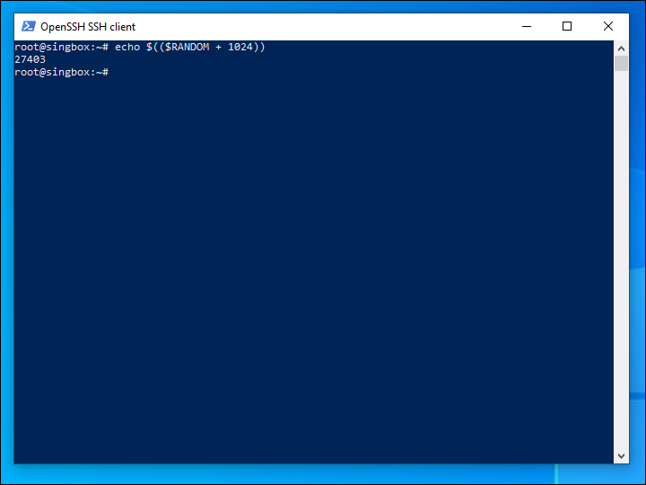

If your server has a firewall, you'll need to open this port for TCP input.

Generate a pseudorandom password. The required key length for method `2022-blake3-aes-128-gcm` is 16 bytes, for `2022-blake3-aes-256-gcm` 32 bytes, and for `2022-blake3-chacha20-poly1305` 32 bytes. We will generate a 16-byte key, expressed in base-64 notation:

```
openssl rand -base64 16
```

Our examples will use the result `Q54xMLyzJeNIPuBmQdS1Rw==`.

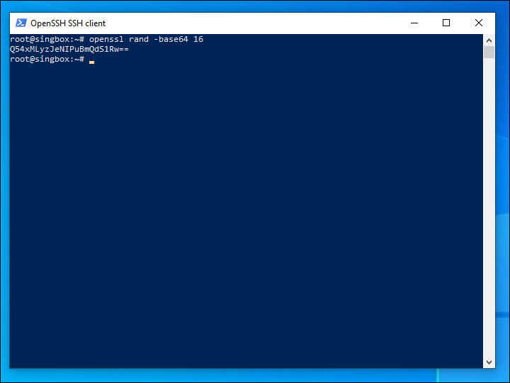

Install the latest version of Sing-Box:

```
apt update && apt upgrade

bash <(curl -fsSL https://sing-box.app/deb-install.sh)
```

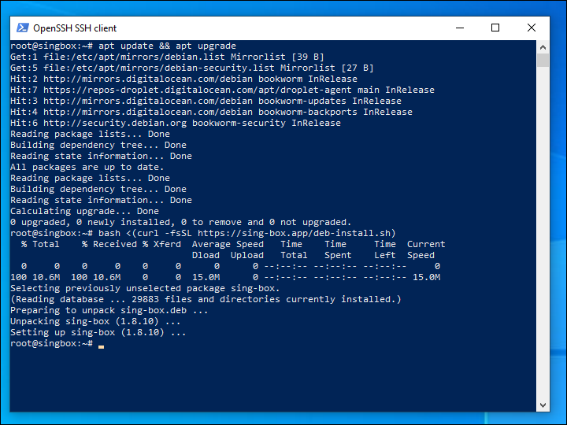

When the install is complete, edit the JSON configuration file `/etc/sing-box/config.json`:

```
nano /etc/sing-box/config.json
```

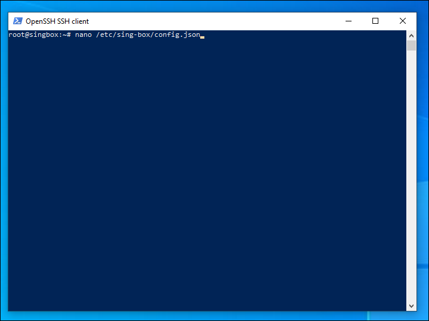

The initial JSON configuration file `/etc/sing-box/config.json` looks like this. Review the server configuration parameters. Change the port number and password as desired:

```
    {
      "log": {
        "level": "info"
      },
      "dns": {
        "servers": [
          {
            "address": "tls://8.8.8.8"
          }
        ]
      },
      "inbounds": [
        {
          "type": "shadowsocks",
          "listen": "::",
          "listen_port": 27403,
          "sniff": true,
          "network": "tcp",
          "method": "2022-blake3-aes-128-gcm",
          "password": "Q54xMLyzJeNIPuBmQdS1Rw=="
        }
      ],
      "outbounds": [
        {
          "type": "direct"
        },
        {
          "type": "dns",
          "tag": "dns-out"
        }
      ],
      "route": {
        "rules": [
          {
            "protocol": "dns",
            "outbound": "dns-out"
          }
        ]
      }
    }
```

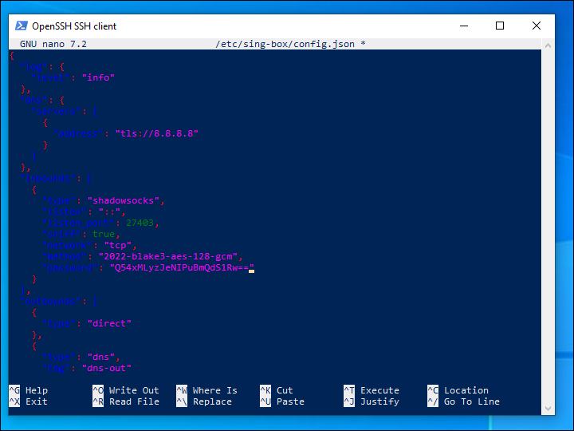

Save the file `/etc/sing-box/config.json`.

Start the Sing-Box server with this configuration:

```
systemctl enable sing-box

systemctl start sing-box
```

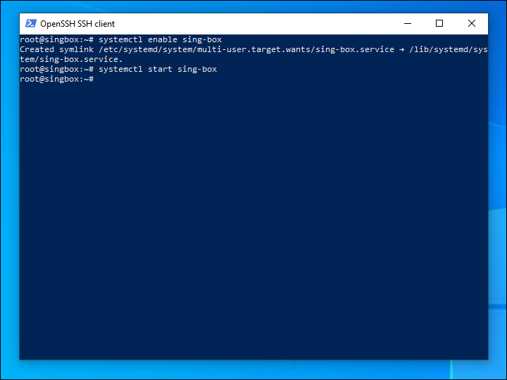

## Windows client

The client system clock must match the server clock to within 30 seconds. On your PC, go to **Settings** > **Time & Language** > **Date & time**. If necessary, synchronize your clock with the **Sync now** button. 

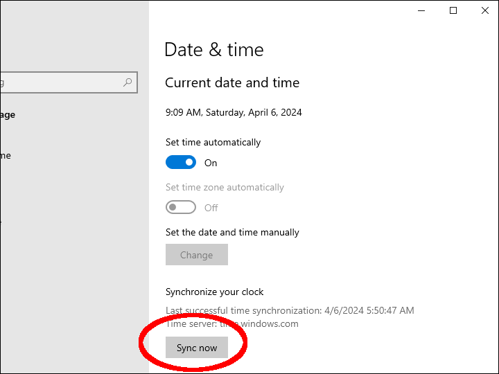

Install Microsoft Visual C++ Redistributable for Visual Studio 2015-2022 as explained on [learn.microsoft.com](https://learn.microsoft.com/en-us/cpp/windows/latest-supported-vc-redist?view=msvc-170).

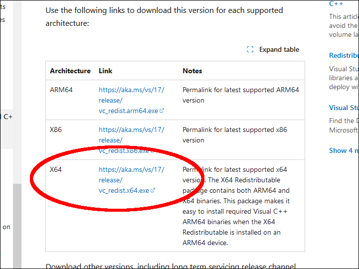

Download the client zip file `nekoray-*-windows64.zip` from the latest release of [github.com/MatsuriDayo/nekoray](https://github.com/MatsuriDayo/nekoray).

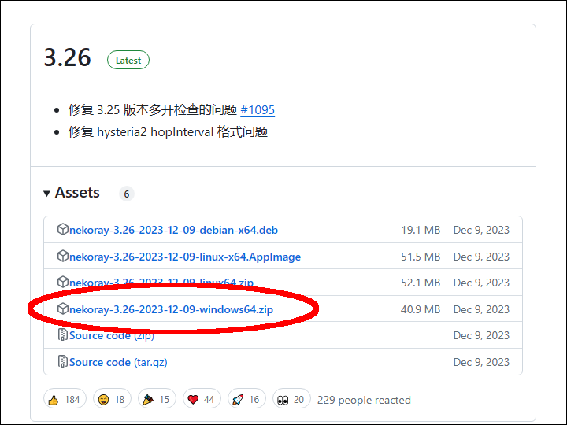

Unzip the client zip file `nekoray-*-windows64.zip`.

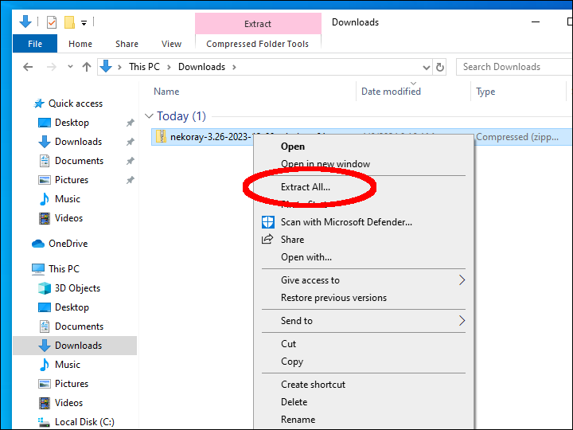

Double-click to start the `nekoray.exe` application.

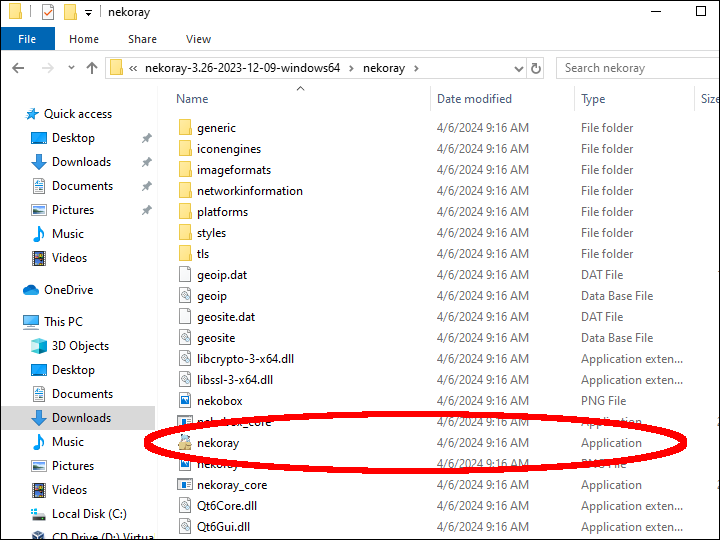

The first time in, select `sing-box` as your core.

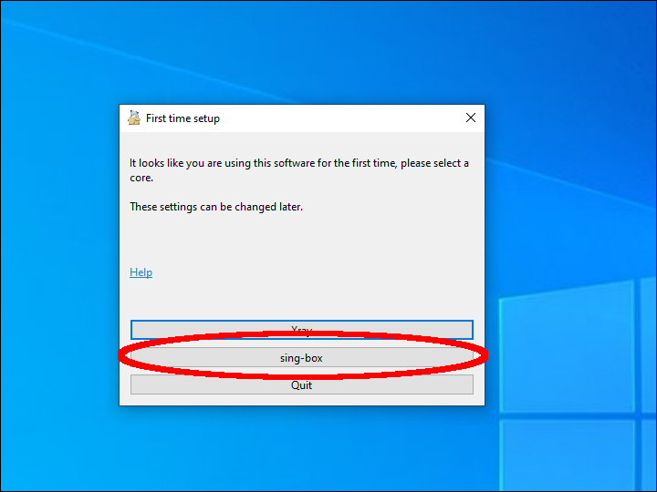

If Windows Defender Firewall pops up, select all networks, and click **Allow access**.

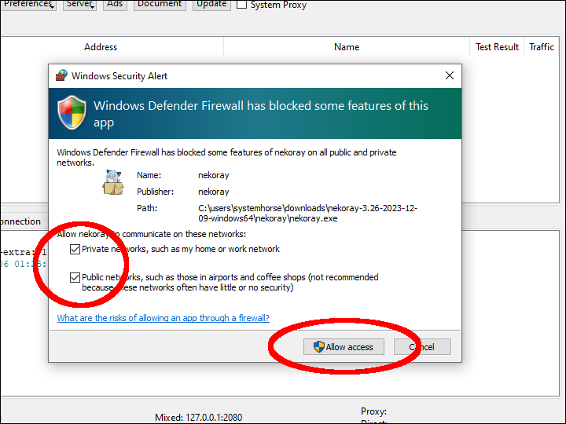

In the Sing-Box GUI, check the box for **System Proxy**.

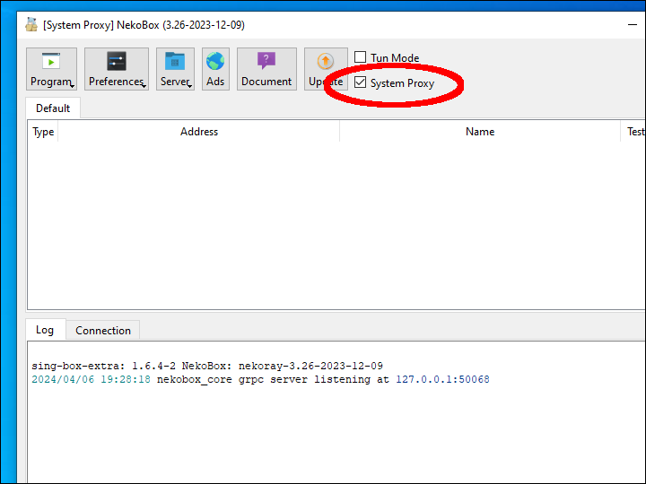

Select **Server** > **New profile**.

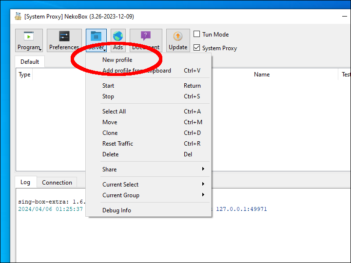

Add the new profile parameters:

* Type **Shadowsocks**
* Name whatever you want
* Address is your server IP address
* Port `27403` (or whatever you changed it to)
* Encryption **2022-blake3-aes-128-gcm**
* Password `Q54xMLyzJeNIPuBmQdS1Rw==` (or whatever you changed it to)

Click **OK** to save the new profile.

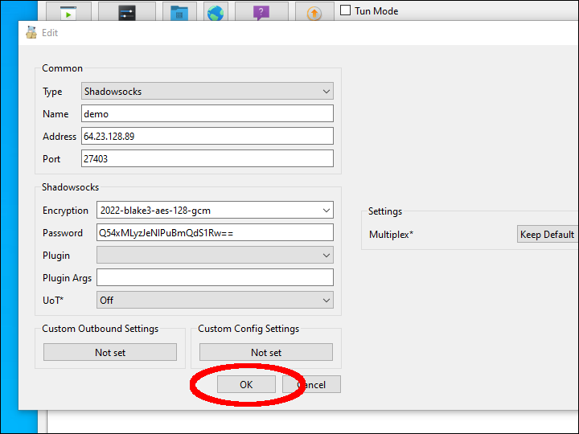

Right-click on the profile and **Start** the connection.

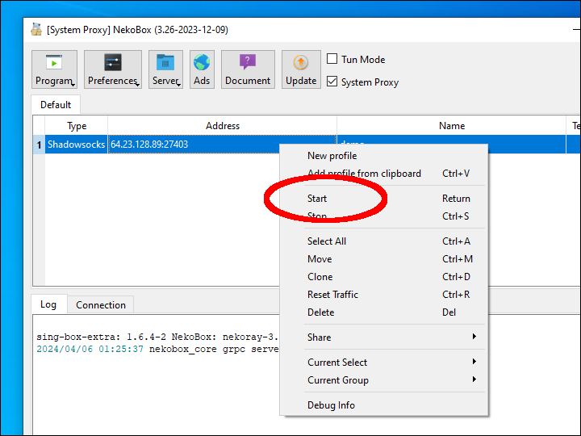
